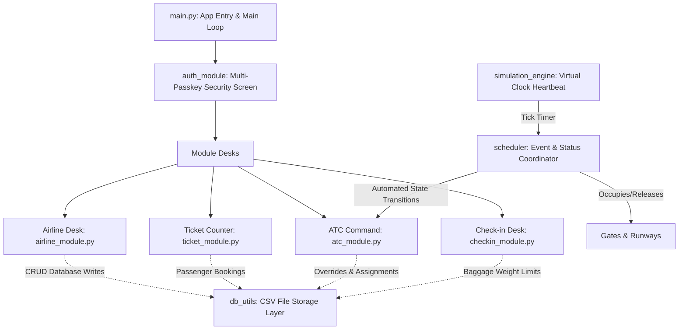
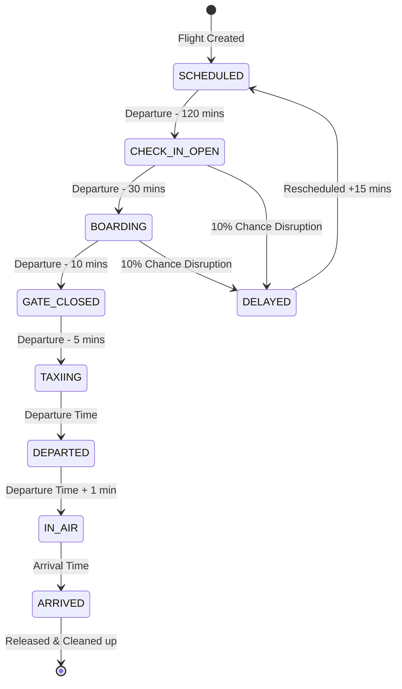

# Product Requirement Document (PRD)
## Airport Management System (AMS)
### *A High-Fidelity Accelerated Time Desktop Simulation & Console*

---

## 1. Document Control & Metadata

| Field | Detail |
| :--- | :--- |
| **Product Name** | Airport Management System (AMS) |
| **Document Version** | v1.0.0 (Production Release) |
| **Date** | May 21, 2026 |
| **Status** | Approved & Implemented |
| **Target Platforms** | Windows (OS Core), Linux, macOS |
| **Framework Stack** | Python 3.10+, Tkinter (GUI), Pygame & OpenCV-Python (Media), Flat CSVs (Database) |
| **Author** | Senior Systems Architect & AI Engineering Team |

---

## 2. Executive Summary & Product Vision

The **Airport Management System (AMS)** is a highly cohesive, desktop-based management, operations, and flight scheduling platform. Designed to simulate the real-time orchestrations of a modern international airport hub, AMS coordinates complex timelines, resources, and bookings through a seamless, dark-themed user interface.

### The Core Problem
Airports are highly complex, multi-agent systems where flights, passenger check-ins, ticketing operations, crew rosters, gate assignments, and air traffic control (ATC) runways must align precisely. A mistake in any of these modules creates cascading delays, safety hazards, and resource conflicts.

### The AMS Solution
AMS resolves these logistics by providing an integrated administrative dashboard consisting of four locked core operational modules. It is backed by a **Virtual Simulation Engine** that handles automated time progression, flight status transitions, resource locking/releasing, and randomized operational disruptions.

---

## 3. Core Architectural Pillars

The application is structured into five highly decoupled architectural layers:

### A. Dynamic Single-Window View Swapping
To achieve the premium, modern aesthetic of a native desktop application, AMS uses a custom single-window navigation system:
* **The Frame Swap Pattern**: A single `tk.Tk()` main window persists through the runtime. When navigating to another screen, the active frame (`current_frame`) is destroyed, and a new `tk.Frame` is instantiated and passed to the destination page module.
* **Benefits**: Resolves Tkinter memory leaks, maintains global window bounds (fullscreen mode), keeps the focus on a single process, and avoids cluttering the system with multiple popups.
* **Interactive Micro-Animations**: Features HSL tailored hover elements, custom mouse-wheel canvas handlers for seamless scrolling on large lists, and a synchronized top bar back-navigation stack.

### B. The Virtual Accelerated Time Engine (`simulation_engine.py`)
Real-time operations are too slow to evaluate airport systems effectively. AMS solves this with an accelerated simulation clock:
* **Time Progression**: Time is tracked using a Python `datetime` object (`SIM_TIME`) initialized at `2026-01-01 06:00:00`.
* **Growth Rate Multiplier**: Users can customize the simulation speed (e.g., `TIME_SPEED` of `1` second of real-world time translates to `5`, `10`, or `30` virtual minutes).
* **Clock Pulse**: Driven using the Tkinter event loop queue via `root.after(1000, update_simulation)`.

### C. Background ATC Event Scheduler (`scheduler.py`)
A custom-engineered priority queue manages future airport events (such as scheduled runway releases):
* **Event Dispatcher**: `schedule_event(event_time, callback, *args)` registers future events and maintains a chronological list sorted by time.
* **Auto-Resolution Loop**: Every virtual minute, the scheduler scans this queue and executes callback routines for events that are due.

### D. High-Integrity CRUD Persistence Layer (`db_utils.py`)
To keep the application lightweight and zero-dependency, data persistence uses raw CSV files. `db_utils.py` serves as the Object-Relational Mapper (ORM), implementing:
* **Thread-Safe File Rewrites**: Read operations load full data frames into RAM, whereas writes modify the list structures and atomically rewrite files with correct header formatting.
* **Resource Assignment Guard**: Guarantees that adding or deleting resources (flights, crew, gates, runways) updates associated counts and releases linked assets automatically.

---

## 4. Module-by-Module Explanations, Logic & Workflows

### 4.1 main.py (App Core & Global Router)
* **Purpose**: Serves as the central application orchestrator, initial screen loader, global theme token holder, and master router.
* **Design Tokens & Theme System**:
  * `BG_COLOR` (`#0f172a`): Deep space dark-navy blue for primary backgrounds.
  * `CARD_COLOR` (`#1e293b`): Sleek slate card backgrounds creating visual contrast.
  * `BORDER_COLOR` (`#243249`): Subtle outline borders.
  * `ACCENT_COLOR` (`#4f46e5`): Indigo accent color representing launch operations.
  * `BTN_SUCCESS` (`#10b981`): Emerald green for positive action buttons.
  * `BTN_DANGER` (`#f43f5e`): High-intensity rose-red for delete or cancel operations.
* **Workflow & Logic**:
  1. Instantiates `root = tk.Tk()`, sets borderless fullscreen, and binds `Escape` to return to windowed mode.
  2. Binds global mouse-wheel events to handle scroll canvases natively.
  3. Registers `refresh_clock()`, running asynchronously every 1,000 ms to render the virtual clock in the bottom status bar.
  4. Renders the main dashboard: a premium `2x2` grid showcasing the four desks with dynamic hover glows (a micro-animation where buttons turn white with colored text on mouse entrance).
  5. Hosts the `switch_page()` router and the **Simulation Control Center Settings Modal**, enabling operators to reset database files, fast-forward time, or alter clock rates.

---

### 4.2 runmain.py (Cinematic Intro Launcher)
* **Purpose**: Runs a cinematic load screen to immerse the user before starting the main administrative panel.
* **Workflow & Logic**:
  1. Opens a fullscreen Pygame graphic context.
  2. Uses OpenCV (`cv2`) to stream frames from `./assets/finalappintro.mp4`.
  3. Projects frame-by-frame matrices onto Pygame surfaces at 30 frames per second.
  4. Captures event handlers (e.g. hitting `Return` or `Escape` stops playback instantly).
  5. Shuts down Pygame gracefully and executes `import main` to launch the Tkinter GUI thread.

---

### 4.3 auth_module.py (Desk Authentication Gates)
* **Purpose**: Simulates enterprise-level credentials, ensuring only certified airport staff can access specific operational modules.
* **Security Configurations**:
  * **Airline Desk**: `air123`
  * **Ticket Counter**: `ticket123`
  * **ATC Command Desk**: `atc123`
  * **Check-In Desk**: `check123`
* **Workflow & Logic**:
  1. Clicking a dashboard console launches `show_passkey_page()`.
  2. The page renders a security card with a password field displaying asterisks (`*`) for confidentiality.
  3. Binds the `<Return>` key to the input box.
  4. If the key matches the hardcoded authorization list, the user is forwarded to the module; otherwise, a dialog showing "Access Denied" blocks navigation.

---

### 4.4 db_utils.py (Persistence ORM & Utility Desk)
* **Purpose**: Direct CRUD operations on CSV files.
* **Key Methods & Internal Logic**:
  * `reset_simulation_data()`: Resets all flights to `SCHEDULED`, removes runway allocations, and marks all gates/runways as `AVAILABLE`. This maintains reference database states for testing.
  * `_normalize_flight_row(row)`: A safety wrapper that maps different CSV column names (e.g. `departure_time` vs `departure`, `airline` vs `airline_id`) to single object keys.
  * `update_passenger_checkin(passenger_id, checked_in, baggage_weight)`: Opens `passengers.csv`, finds the matching row, edits the values, and performs a complete atomic flush back to disk.

---

### 4.5 airline_module.py (Airlines, Schedules, Aircraft & Crew Desk)
* **Purpose**: Allows fleet planning, flight dispatching, and crew roster management.
* **Interactive Workflows**:
  * **Edit Airlines**: Review current carriers, edit names, adjust active fleet sizes, or delete records.
  * **Schedule Flights**: Dispatch new flights. The form auto-assigns an available gate/runway to prevent conflicts, increments the airline's active flight count, and logs the schedule.
  * **Roster Crew**: Add pilots, flight attendants, and engineers. Renders crew IDs automatically using a prefix + padding formula (`CR001`, `CR002`, etc.).
* **Under-the-Hood Logic & DB Side-effects**:
  * When deleting a flight:
    1. Loads the flight row.
    2. Frees up the associated gate (setting it back to `Available`).
    3. Frees up the associated runway.
    4. Finds the airline record and decrements the fleet count (`flights = flights - 1`).
    5. Saves changes to database CSV files.

---

### 4.6 ticket_module.py (Passenger Ticket Counter & Booking Desk)
* **Purpose**: Manages passenger ticketing, routes search, seat matrices, and boarding passes.
* **Key Workflows**:
  * **View Available Flights**: Reviews schedule boards. Filters out flights that have already departed or are active.
  * **Book Ticket**:
    1. **Cascading Search Input**: Selecting a Source dynamically filters and updates eligible Destinations.
    2. **Cascading Flight Finder**: Choosing a Destination fetches only valid flights on that route (excluding already departed, arrived, or closed flights).
    3. **Seat Matrix Allocation**: Selecting a flight retrieves all passengers booked for that flight ID. It generates a 3D matrix (10 rows, seats A to F) and disables booked seats, rendering only available options in a dropdown.
  * **Print Monospaced Boarding Ticket**: Generates a receipt with a retro, monospaced layout inside a white popup card, showing flight paths, boarding seat, luggage weight, and status.

---

### 4.7 atc_module.py (Air Traffic Control Command Center)
* **Purpose**: Renders the physical state of the airfield, manages runways, terminals, and allows status overrides.
* **Interactive Workflows**:
  * **Gate & Runway Trackers**: Lists gates/runways and allows manual overrides (e.g., closing a runway for maintenance, which marks it `OCCUPIED` in CSV files).
  * **Active Flight Progress Boards**: Displays all active flights, origin/destination, and a visual progress tracker.
  * **Automated Flight Progress Bar Logic**:
    * If `status` is `SCHEDULED`, progress is `0%`.
    * If `status` is `ARRIVED`, progress is `100%`.
    * Otherwise, calculates progression using virtual minutes:
      $$\text{Progress \%} = \frac{\text{Current Minutes} - \text{Departure Minutes}}{\text{Arrival Minutes} - \text{Departure Minutes}}$$
    * Overnight flights crossing `00:00` are handled by adding `24 * 60` minutes to the calculation.
    * Renders progress using an interactive Canvas object, moving a tiny airplane glyph (`✈`) along a timeline.
  * **Manual Flight Overrides**: Allows ATC operators to manually override status entries via dropdowns (e.g., forcing a delayed flight to land early).

---

### 4.8 checkin_module.py (Baggage Manifest & Desk)
* **Purpose**: Coordinates passenger luggage checks and logs baggage records.
* **Key Workflows**:
  * **Passenger Check-in**: Staff enters the passenger's ID.
  * **Luggage Weight Restriction Guard**:
    * Staff enters baggage weight.
    * The module applies a **strict 25 kg safety limit**.
    * If weight is $> 25\text{ kg}$, it denies check-in and halts updates.
    * If valid, updates passenger record `checked_in = "Yes"`, and sets weight.
  * **Manifest Boards**: Renders lists showing baggage weight and check-in statuses.

---

## 5. Detailed Flight Lifecycle State Machine

The heart of the airport simulation is the **Flight Lifecycle State Machine** managed in `scheduler.py`. Every simulated clock tick evaluates the flights and triggers transitions:

### Transition Execution Details

1. **SCHEDULED $\rightarrow$ CHECK-IN OPEN (Departure Time - 120 mins)**
   * *Side effects*: Locks the assigned departure gate in `gates.csv` (`status` is set to `OCCUPIED`).
   * *Disruption Hook*: Runs a 10% delay risk check. If triggered, the flight's status changes to `DELAYED`, rescheduling departure and arrival times by 15 minutes.

2. **CHECK-IN OPEN $\rightarrow$ BOARDING (Departure Time - 30 mins)**
   * *Side effects*: Keeps the gate status locked as `OCCUPIED`.
   * *Disruption Hook*: Runs another 10% delay check to simulate late-arriving passengers.

3. **BOARDING $\rightarrow$ GATE CLOSED (Departure Time - 10 mins)**
   * *Side effects*: Ends passenger boarding. Passengers can no longer register luggage.

4. **GATE CLOSED $\rightarrow$ TAXIING (Departure Time - 5 mins)**
   * *Side effects*: Renders runway assignments. Locks the assigned runway in `runways.csv` (`status` set to `OCCUPIED`). Releases the gate (`status` set to `AVAILABLE`).
   * *Release Event*: Queues a runway release event in the scheduler to free the runway 15 minutes after takeoff.

5. **TAXIING $\rightarrow$ DEPARTED (At Scheduled Departure Time)**
   * *Side effects*: Flight takes off.

6. **DEPARTED $\rightarrow$ IN AIR**
   * *Side effects*: Status changes to `IN AIR` as the aircraft leaves the airspace.

7. **IN AIR $\rightarrow$ ARRIVED (At Scheduled Arrival Time)**
   * *Side effects*: Releases all airport resources. Sets runway and gate statuses back to `AVAILABLE`.

8. **Overnight Auto-Reset**
   * *Logic*: If the clock moves past midnight (`00:00`), `process_flights` automatically resets `ARRIVED` or `CANCELLED` flights back to `SCHEDULED` for the next operational day.

---

## 6. CSV Database Schema & Data Models

The database comprises six tables stored in `/database/*.csv`.

### 6.1 `database/airlines.csv`
Represents airlines registered to operate at the airport.
* **Columns**:
  * `airline_id` (Primary Key, e.g. `AIR001`): Unique identifier.
  * `name` (String): Airline carrier name.
  * `flights` (Integer): Renders total active aircraft/scheduled flights.

### 6.2 `database/crew.csv`
Contains flight crew members and their roles.
* **Columns**:
  * `crew_id` (Primary Key, e.g. `CR001`): Unique identifier.
  * `name` (String): Crew name.
  * `role` (Enum): `Captain`, `Co-Pilot`, `Flight Attendant`, `Engineer`, `Ground Staff`.
  * `airline_id` (Foreign Key $\rightarrow$ `airlines.airline_id`): Parent airline.

### 6.3 `database/flights.csv`
Tracks scheduled flights, routes, gates, and operational statuses.
* **Columns**:
  * `flight_id` (Primary Key, e.g. `FL001`): Unique flight number.
  * `airline` (Foreign Key $\rightarrow$ `airlines.airline_id`): Assigned airline carrier.
  * `origin` (String): Departure airport code.
  * `destination` (String): Destination airport code.
  * `departure_time` (String, format `HH:MM`): Scheduled takeoff.
  * `arrival_time` (String, format `HH:MM`): Scheduled landing.
  * `status` (Enum): `SCHEDULED`, `CHECK-IN OPEN`, `BOARDING`, `GATE CLOSED`, `TAXIING`, `DEPARTED`, `IN AIR`, `ARRIVED`, `DELAYED`, `CANCELLED`.
  * `gate` (Foreign Key $\rightarrow$ `gates.gate_id`): Assigned boarding terminal gate.
  * `runway` (Foreign Key $\rightarrow$ `runways.runway_id`): Assigned runway.

### 6.4 `database/passengers.csv`
Stores passenger manifests, seat bookings, and baggage weights.
* **Columns**:
  * `passenger_id` (Primary Key, e.g. `PASS001`): Unique identifier.
  * `name` (String): Passenger name.
  * `flight_id` (Foreign Key $\rightarrow$ `flights.flight_id`): Booked flight.
  * `seat` (String, format `01A` to `10F`): Allocated seat.
  * `checked_in` (Enum: `Yes`, `No`): Check-in status.
  * `baggage_weight` (Float): Registered luggage weight in kg.

### 6.5 `database/runways.csv`
Tracks runway metrics and availability.
* **Columns**:
  * `runway_id` (Primary Key, e.g. `RUNWAY_01`): Runway code.
  * `length` (Integer): Runway length in meters.
  * `status` (Enum: `AVAILABLE`, `OCCUPIED`): Runway availability status.

### 6.6 `database/gates.csv`
Monitors terminal gate assignments.
* **Columns**:
  * `gate_id` (Primary Key, e.g. `GATE_A1`): Gate code.
  * `terminal` (String): Terminal location description.
  * `status` (Enum: `AVAILABLE`, `OCCUPIED`): Gate availability status.

---

## 7. Future Roadmap & Scalability Enhancements

While the current Python and CSV-based architecture is reliable and lightweight for standalone desktops, expanding the system for commercial operations involves the following enhancements:

### Phase 1: Relational Database Migration (SQL)
* **Goal**: Replace CSV engines with SQL engines (such as SQLite or PostgreSQL) to enforce transaction safety, cascading updates, and database constraints.
* **Action**: Refactor `db_utils.py` methods to run standard SQL queries instead of rewriting CSV files.

### Phase 2: RESTful Microservices API Layer
* **Goal**: Separate the GUI from the backend engine.
* **Action**: Wrap the Simulation Engine and Database CRUD operations in a FastAPI/Flask application, exposing HTTP endpoints (e.g. `POST /api/bookings`) so multiple consoles can sync with the same core system.

### Phase 3: Web-Based Dashboard UI
* **Goal**: Modernize UI delivery by transitioning from desktop Tkinter to a web framework.
* **Action**: Rebuild the console screens using a premium responsive Next.js frontend with modern CSS elements (glassmorphism, interactive charts, and animations), powered by a persistent database connection.

### Phase 4: Dynamic Baggage-Sorting Simulation
* **Goal**: Expand check-in desk capabilities.
* **Action**: Integrate a visual baggage-belt sorting simulation, routing luggage to flight containers based on baggage tags and tracking logistics in a custom dashboard.

---

> [!NOTE]
> This Product Requirement Document serves as the official design blueprint for the Airport Management System (AMS). It preserves code integrity while detailing the system's design, operational logic, and architecture.
