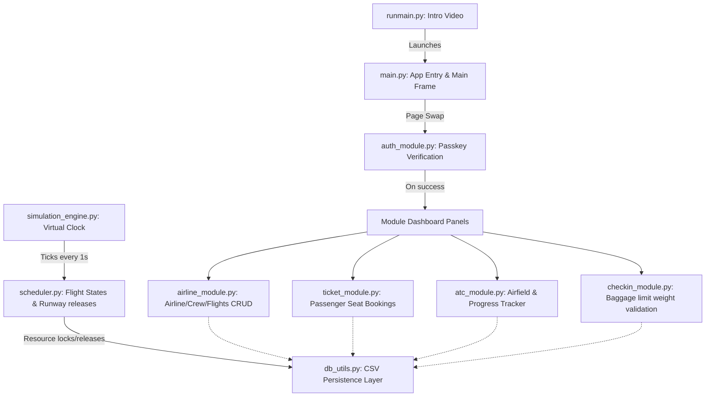
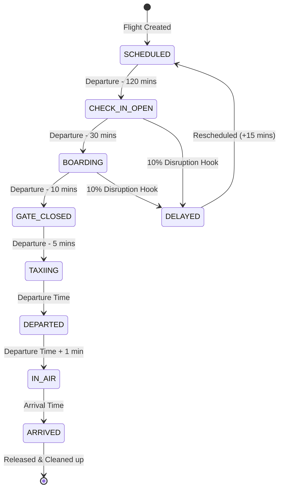

# Airport Management System: Workflow & Technical Reference Manual

This document provides a comprehensive technical overview and function-by-function reference of the **Airport Management System (AMS)**. It outlines the project's single-window architecture, theme specifications, CSV schemas, simulation logic, flight lifecycle state machine, and lists every module and Python function in the codebase.

---

## 1. System Architecture & Core Mechanics

The AMS is built on a decoupled, multi-layered architecture that runs within a single thread powered by the Tkinter event loop.

### Dynamic Single-Window Frame Swapping
To mimic a modern native desktop application, the system uses a **Frame Swap Pattern** rather than spawning secondary popup windows:
1. A single root `tk.Tk()` window persists.
2. Navigating to a page calls the global `switch_page(page_function, *args)` router.
3. The router destroys the active frame (`current_frame`) to prevent memory leaks and instantiates a new `tk.Frame` inside a global scrollable canvas.
4. The page builder function populates the new frame.

### Mouse-Wheel Canvas Scrolling
For screens with lists of dynamic height, the main container embeds a `tk.Canvas` with a vertical `tk.Scrollbar`. Global mouse-wheel event listeners are bound to target the canvas, allowing scroll events to propagate seamlessly.

---

## 2. Premium Design System

The application employs a dark-navy space theme with high-fidelity components and subtle micro-animations.

### Color Palette
*   **Background (`BG_COLOR`)**: `#0f172a` (deep slate navy blue)
*   **Card Background (`CARD_COLOR`)**: `#1e293b` (slate card panels)
*   **Border Outline (`BORDER_COLOR`)**: `#243249` (subtle outline stroke)
*   **Primary Text (`TEXT_COLOR`)**: `#f8fafc` / `white` (off-white for high legibility)
*   **Secondary Text (`SUB_TEXT`)**: `#94a3b8` / `#cbd5e1` (muted slate gray)
*   **Accent Color (`ACCENT_COLOR`)**: `#4f46e5` / `#2563eb` (royal indigo/blue)
*   **Accent Hover (`ACCENT_HOVER`)**: `#6366f1` (bright violet-indigo)
*   **Success Button (`BTN_SUCCESS`)**: `#10b981` / `#22c55e` (emerald green)
*   **Danger Button (`BTN_DANGER`)**: `#f43f5e` / `#ef4444` (crimson red)

### Micro-Animations
*   **Glow Button Hover**: Active UI elements bind enter/leave events to swap text and background colors dynamically (e.g., turning white with a colored border/glow on hover).
*   **Canvas Aircraft Tracker**: Flight schedule logs render a miniature plane symbol (`✈`) moving along a simulated timeline canvas based on real-time flight progress.

---

## 3. Database Schema & Data Models

Data persistence is handled by raw flat-file CSVs located in the `database/` directory.

### 3.1 Airlines (`airlines.csv`)
Tracks registered commercial air carriers.
*   `airline_id` (Primary Key, e.g., `AIR001`): Unique identifier.
*   `name` (String): Airline carrier name.
*   `flights` (Integer): Total active/scheduled aircraft under this carrier.

### 3.2 Flight Crew (`crew.csv`)
Contains crew personnel records.
*   `crew_id` (Primary Key, e.g., `CR001`): Unique identifier.
*   `name` (String): Crew member's full name.
*   `role` (Enum): `Captain`, `Co-Pilot`, `Flight Attendant`, `Engineer`, `Ground Staff`.
*   `airline_id` (Foreign Key $\rightarrow$ `airlines.airline_id`): Airline employing the crew member.

### 3.3 Flights (`flights.csv`)
Primary registry for scheduled flights and routes.
*   `flight_id` (Primary Key, e.g., `FL001`): Unique identifier.
*   `airline` (Foreign Key $\rightarrow$ `airlines.airline_id`): Operating airline.
*   `origin` (String): Source airport code (e.g., `JFK`, `LHR`).
*   `destination` (String): Destination airport code (e.g., `DXB`, `SIN`).
*   `departure_time` (String, `HH:MM`): Scheduled departure time.
*   `arrival_time` (String, `HH:MM`): Scheduled arrival time.
*   `status` (Enum): `SCHEDULED`, `CHECK-IN OPEN`, `BOARDING`, `GATE CLOSED`, `TAXIING`, `DEPARTED`, `IN AIR`, `ARRIVED`, `DELAYED`, `CANCELLED`.
*   `gate` (Foreign Key $\rightarrow$ `gates.gate_id`): Assigned departure/arrival gate.
*   `runway` (Foreign Key $\rightarrow$ `runways.runway_id`): Assigned runway.

### 3.4 Passengers (`passengers.csv`)
Passenger boarding list and luggage logs.
*   `passenger_id` (Primary Key, e.g., `PASS001`): Unique passenger identifier.
*   `name` (String): Passenger's full name.
*   `flight_id` (Foreign Key $\rightarrow$ `flights.flight_id`): Booked flight ID.
*   `seat` (String, e.g., `04B`): Seat number in row-seat format (Rows 1-10, seats A-F).
*   `checked_in` (Enum: `Yes`, `No`): Passenger check-in status.
*   `baggage_weight` (Float): Luggage weight in kg.

### 3.5 Runways (`runways.csv`)
Tracks airfield runway resources.
*   `runway_id` (Primary Key, e.g., `RUNWAY_01`): Runway identifier.
*   `length` (Integer): Runway length in meters.
*   `status` (Enum: `AVAILABLE`, `OCCUPIED`): Current runway status.

### 3.6 Gates (`gates.csv`)
Terminal boarding gates.
*   `gate_id` (Primary Key, e.g., `GATE_A1`): Gate code.
*   `terminal` (String): Terminal location description.
*   `status` (Enum: `AVAILABLE`, `OCCUPIED`): Terminal gate availability.

---

## 4. Flight Lifecycle State Machine

A background state machine in `scheduler.py` automatically updates flight states and allocates/deallocates airport resources based on the accelerated simulation timeline.

### Transition Operations & Side-Effects
1.  **SCHEDULED $\rightarrow$ CHECK-IN OPEN (Departure - 120 mins)**:
    *   *Side-Effect*: Locks the assigned departure gate (`gates.csv` status $\rightarrow$ `OCCUPIED`).
    *   *Disruption*: Triggers a 10% delay risk check. If triggered, the flight's departure and arrival times are postponed by 15 minutes and status is set to `DELAYED`.
2.  **CHECK-IN OPEN $\rightarrow$ BOARDING (Departure - 30 mins)**:
    *   *Side-Effect*: Departure gate remains locked (`OCCUPIED`).
    *   *Disruption*: Triggers a second 10% delay risk check.
3.  **BOARDING $\rightarrow$ GATE CLOSED (Departure - 10 mins)**:
    *   *Side-Effect*: Closes boarding. Passenger check-in for this flight ID is blocked.
4.  **GATE CLOSED $\rightarrow$ TAXIING (Departure - 5 mins)**:
    *   *Side-Effect*: Allocates and locks the assigned runway (`runways.csv` status $\rightarrow$ `OCCUPIED`). Releases the gate back to `AVAILABLE`.
    *   *Event*: Queues a scheduled runway release event to fire 15 minutes after takeoff.
5.  **TAXIING $\rightarrow$ DEPARTED (Departure Time)**:
    *   *Side-Effect*: The aircraft takes off.
6.  **DEPARTED $\rightarrow$ IN AIR (Departure Time + 1 min)**:
    *   *Side-Effect*: Aircraft is in mid-flight. Runway is released after the queued 15-minute runway event expires.
7.  **IN AIR $\rightarrow$ ARRIVED (Arrival Time)**:
    *   *Side-Effect*: Releases all flight resources, setting the assigned gate and runway status to `AVAILABLE`.
8.  **Overnight Reset (Midnight Transition)**:
    *   *Side-Effect*: When the simulation clock crosses `00:00`, all completed `ARRIVED` and `CANCELLED` flights are reset to `SCHEDULED`, and airfield resources are marked `AVAILABLE` for the new day.

---

## 5. Comprehensive Code and Function Reference

Here is a detailed catalogue of all Python functions within the AMS, grouped by source file.

### 5.1 `runmain.py`
Serves as the application's multimedia launcher, playing an introductory video before running the main application context.

*   **File Logic**:
    1.  Initializes a fullscreen Pygame display context.
    2.  Uses OpenCV (`cv2`) to stream frames from `./assets/finalappintro.mp4`.
    3.  Renders frames onto Pygame surfaces at 30 FPS.
    4.  Captures keypresses (`Return` or `Escape` keys) to skip.
    5.  Shuts down Pygame and executes `import main` to launch the Tkinter GUI thread.

---

### 5.2 `main.py`
The central orchestrator of the graphical user interface. It manages the root window, themes, scrolling structures, navigation stack, and the settings modal.

*   `add_hover(widget, hover_bg, normal_bg, hover_fg=None, normal_fg=None)`
    *   **Arguments**: `widget` (Tkinter widget), `hover_bg` (Hex string), `normal_bg` (Hex string), `hover_fg` (Optional hex string), `normal_fg` (Optional hex string)
    *   **Purpose**: Binds `<Enter>` and `<Leave>` events to simulate hover glows on UI buttons.
*   `set_nav_button(text, command)`
    *   **Arguments**: `text` (String), `command` (Callback function)
    *   **Purpose**: Configures and pack-displays the navigation back button in the top status bar.
*   `clear_nav_button()`
    *   **Arguments**: None
    *   **Purpose**: Hides the top-bar navigation button when returning to the home screen.
*   `refresh_clock()`
    *   **Arguments**: None
    *   **Purpose**: Runs an asynchronous loop via `root.after(1000)` to render the active virtual simulation datetime in the status bar.
*   `on_scrollable_configure(event)`
    *   **Arguments**: `event` (Tkinter event object)
    *   **Purpose**: Resets the canvas scrolling region (`scrollregion`) to match the size of its child frame content.
*   `on_canvas_configure(event)`
    *   **Arguments**: `event` (Tkinter event object)
    *   **Purpose**: Dynamically resizes the scrollable frame window to fill the horizontal width of the canvas.
*   `on_mousewheel(event)`
    *   **Arguments**: `event` (Tkinter event object)
    *   **Purpose**: Captures OS mouse-wheel events and scrolls the canvas vertically.
*   `switch_page(page_function, *args)`
    *   **Arguments**: `page_function` (Callable), `*args` (Variable arguments)
    *   **Purpose**: The central navigation controller. Destroys `current_frame` and instantiates a new frame inside the scrollable container, calling `page_function(current_frame, switch_page, *args)`.
*   `route_module(module_name)`
    *   **Arguments**: `module_name` (String matching module constants)
    *   **Purpose**: Routes the application frame to the requested operational module after authentication.
*   `show_settings()`
    *   **Arguments**: None
    *   **Purpose**: Displays the **Simulation Control Center Settings Modal** (`Toplevel` window) to edit time speed rates, adjust simulation time, or wipe data.
*   `show_home(parent, switch_page)`
    *   **Arguments**: `parent` (Tk Frame), `switch_page` (Callable)
    *   **Purpose**: Builds the 2x2 grid console dashboard showing cards for the 4 core desks.

---

### 5.3 `auth_module.py`
Implements password-protected security gateways for each operational module.

*   `add_hover(widget, hover_bg, normal_bg, hover_fg=None, normal_fg=None)`
    *   **Arguments**: Same as `main.py`.
    *   **Purpose**: UI hover binding helper for authentication buttons.
*   `create_header(parent, switch_page, back_page, back_args)`
    *   **Arguments**: `parent` (Frame), `switch_page` (Callable), `back_page` (Callable), `back_args` (Tuple)
    *   **Purpose**: Binds root window navigation to allow staff to return to the home screen.
*   `show_passkey_page(parent, switch_page, module_name, route_callback, back_page, back_args)`
    *   **Arguments**: `parent` (Frame), `switch_page` (Callable), `module_name` (String), `route_callback` (Callable), `back_page` (Callable), `back_args` (Tuple)
    *   **Purpose**: Renders the passkey entry interface. Binds `<Return>` to verify user entries against credentials (`PASSKEYS`).

---

### 5.4 `airline_module.py`
The operational module for managing airline lists, flight schedules, aircraft information, and crew rosters.

*   `create_header(parent, switch_page, back_page, back_args)`
    *   **Arguments**: Standard header arguments.
    *   **Purpose**: Configures the navigation bar back button.
*   `show_airline_dashboard(parent, switch_page, back_page, back_args)`
    *   **Arguments**: Standard panel arguments.
    *   **Purpose**: Displays the primary panel menu options for Airline, Flight, and Crew operations.
*   `show_edit_airlines(parent, switch_page, back_page, back_args)`
    *   **Arguments**: Standard panel arguments.
    *   **Purpose**: Lists active airline carriers with buttons to edit details, add new carriers, or delete them.
*   `delete_airline_action(airline_id, switch_page, current_page, back_args_tuple)`
    *   **Arguments**: `airline_id` (String), `switch_page` (Callable), `current_page` (Callable), `back_args_tuple` (Tuple)
    *   **Purpose**: Deletes the specified airline after confirmation.
*   `show_edit_airline_form(parent, switch_page, back_page, back_args, airline_id)`
    *   **Arguments**: Standard panel arguments + `airline_id` (String).
    *   **Purpose**: Displays the edit form for airline name and active flight counts.
*   `show_add_airline_form(parent, switch_page, back_page, back_args)`
    *   **Arguments**: Standard panel arguments.
    *   **Purpose**: Form to register a new carrier. Automatically increments airline IDs using a padded integer format (`AIR001`, `AIR002`, etc.).
*   `show_add_flights_form(parent, switch_page, back_page, back_args)`
    *   **Arguments**: Standard panel arguments.
    *   **Purpose**: Form to dispatch a new flight. Auto-assigns an available gate and runway from the database, increments the airline's active flight count, and registers the schedule.
*   `show_edit_flights(parent, switch_page, back_page, back_args)`
    *   **Arguments**: Standard panel arguments.
    *   **Purpose**: Lists all flights in a scrollable frame, allowing operators to edit or delete them.
*   `delete_flight_action(flight_id, switch_page, current_page, back_args_tuple)`
    *   **Arguments**: `flight_id` (String), `switch_page` (Callable), `current_page` (Callable), `back_args_tuple` (Tuple)
    *   **Purpose**: Deletes a flight. Automatically releases the assigned gate and runway (setting them to `Available`) and decrements the airline's fleet flight count in `airlines.csv`.
*   `show_edit_flight_form(parent, switch_page, back_page, back_args, flight_id)`
    *   **Arguments**: Standard panel arguments + `flight_id` (String).
    *   **Purpose**: Form to manually adjust a flight's origin, destination, timings, gate, runway, and status. Automatically handles gate and runway occupancy updates if they are modified.
*   `show_airline_information(parent, switch_page, back_page, back_args)`
    *   **Arguments**: Standard panel arguments.
    *   **Purpose**: Renders display cards showcasing each airline's ID and registered fleet size.
*   `show_aircraft_information(parent, switch_page, back_page, back_args)`
    *   **Arguments**: Standard panel arguments.
    *   **Purpose**: Displays a grid view of all aircraft, showing departure/arrival locations, assigned gates, runways, and current operational states.
*   `show_crew_data(parent, switch_page, back_page, back_args)`
    *   **Arguments**: Standard panel arguments.
    *   **Purpose**: Renders a read-only list showing crew IDs, names, roles, and their assigned airlines.
*   `show_edit_crew(parent, switch_page, back_page, back_args)`
    *   **Arguments**: Standard panel arguments.
    *   **Purpose**: Displays the crew list with buttons to edit or delete members, and an option to add new crew members.
*   `delete_crew_action(crew_id, switch_page, current_page, back_args_tuple)`
    *   **Arguments**: `crew_id` (String), `switch_page` (Callable), `current_page` (Callable), `back_args_tuple` (Tuple)
    *   **Purpose**: Deletes a crew member from `crew.csv`.
*   `show_edit_crew_form(parent, switch_page, back_page, back_args, crew_id)`
    *   **Arguments**: Standard panel arguments + `crew_id` (String).
    *   **Purpose**: Displays a form with dropdown menus to edit a crew member's name, role, and airline.
*   `show_add_crew_form(parent, switch_page, back_page, back_args)`
    *   **Arguments**: Standard panel arguments.
    *   **Purpose**: Displays a form to register new crew members, generating a unique ID sequentially (`CR001`, `CR002`, etc.).

---

### 5.5 `ticket_module.py`
Handles passenger seat bookings, retro boarding ticket formatting, and passenger itineraries.

*   `create_header(parent, switch_page, back_page, back_args)`
    *   **Arguments**: Standard header arguments.
    *   **Purpose**: Configures the navigation bar back button.
*   `show_ticket_dashboard(parent, switch_page, back_page, back_args)`
    *   **Arguments**: Standard panel arguments.
    *   **Purpose**: Renders the ticket desk options (View Available Flights, Book Ticket, View Bookings, Print Ticket).
*   `show_flights_list(parent, switch_page, back_page, back_args)`
    *   **Arguments**: Standard panel arguments.
    *   **Purpose**: Displays a list of scheduled flights that are currently on schedule.
*   `show_booking_form(parent, switch_page, back_page, back_args)`
    *   **Arguments**: Standard panel arguments.
    *   **Purpose**: Renders the ticket booking interface:
        *   Automatically generates a new passenger ID (`PASS001`, `PASS002`, etc.).
        *   **Cascading Dropdowns**: Selecting a Source dynamically filters and updates the Destination list. Selecting a Destination dynamically filters and updates the flight dropdown list (filtering out active, closed, or departed flights).
        *   **Seat Selection Grid**: Selecting a flight checks current passenger bookings, generates a 3D matrix (10 rows, seats A-F), and disables booked seats, rendering only available options.
*   `show_bookings_list(parent, switch_page, back_page, back_args)`
    *   **Arguments**: Standard panel arguments.
    *   **Purpose**: Lists passenger bookings with names, flight numbers, and assigned seats.
*   `show_print_ticket_prompt(parent, default_passenger_id=None)`
    *   **Arguments**: `parent` (Frame/Toplevel), `default_passenger_id` (Optional string)
    *   **Purpose**: Spawns a modal window to search for a passenger ID and renders a retro boarding ticket with flight details, seat coordinates, check-in status, and baggage weight.

---

### 5.6 `checkin_module.py`
Manages the check-in desk, validating passenger records and baggage weights.

*   `create_header(parent, switch_page, back_page, back_args)`
    *   **Arguments**: Standard header arguments.
    *   **Purpose**: Configures the navigation bar back button.
*   `show_checkin_dashboard(parent, switch_page, back_page, back_args)`
    *   **Arguments**: Standard panel arguments.
    *   **Purpose**: Displays the check-in options (Check-in Passenger, View Baggage Info, Checked-in Passengers).
*   `show_checkin_form(parent, switch_page, back_page, back_args)`
    *   **Arguments**: Standard panel arguments.
    *   **Purpose**: Renders the passenger check-in form.
        *   **Baggage weight check**: Restricts check-in to a maximum weight of **25 kg**. Baggage over 25 kg is rejected, and check-in is denied.
        *   If valid, updates the passenger's status to `Yes` and saves the baggage weight in the database.
*   `show_baggage_info(parent, switch_page, back_page, back_args)`
    *   **Arguments**: Standard panel arguments.
    *   **Purpose**: Lists passenger IDs, names, registered baggage weights, and check-in statuses.
*   `show_checkedin_passengers(parent, switch_page, back_page, back_args)`
    *   **Arguments**: Standard panel arguments.
    *   **Purpose**: Displays a list of all passengers who have successfully checked in.

---

### 5.7 `atc_module.py`
The Air Traffic Control Command Center. Tracks flight progress in real-time, displays gate/runway statuses, and allows manual overrides.

*   `create_header(parent, switch_page, back_page, back_args)`
    *   **Arguments**: Standard header arguments.
    *   **Purpose**: Configures the navigation bar back button.
*   `show_atc_dashboard(parent, switch_page, back_page, back_args)`
    *   **Arguments**: Standard panel arguments.
    *   **Purpose**: Displays ATC options (Gate Management, Runway Management, Flight Schedule, Flight Status Updates).
*   `show_gate_management(parent, switch_page, back_page, back_args)`
    *   **Arguments**: Standard panel arguments.
    *   **Purpose**: Lists all gates and their status, with buttons to toggle gate availability (`AVAILABLE` vs `OCCUPIED`).
*   `update_gate_status(gate_id, new_status, switch_page, current_page, back_page, back_args)`
    *   **Arguments**: `gate_id` (String), `new_status` (String), `switch_page` (Callable), `current_page` (Callable), `back_page` (Callable), `back_args` (Tuple)
    *   **Purpose**: Updates a gate's availability status and refreshes the page.
*   `show_runway_management(parent, switch_page, back_page, back_args)`
    *   **Arguments**: Standard panel arguments.
    *   **Purpose**: Lists runways and their status, with buttons to toggle runway availability.
*   `update_runway_status(runway_id, new_status, switch_page, current_page, back_page, back_args)`
    *   **Arguments**: `runway_id` (String), `new_status` (String), `switch_page` (Callable), `current_page` (Callable), `back_page` (Callable), `back_args` (Tuple)
    *   **Purpose**: Updates a runway's availability status and refreshes the page.
*   `show_flight_schedule(parent, switch_page, back_page, back_args)`
    *   **Arguments**: Standard panel arguments.
    *   **Purpose**: The central airfield tracking dashboard.
        *   Renders a table of flights with origins, destinations, departure/arrival times, gate and runway allocations, and statuses.
        *   **Real-time Flight Progress calculation**:
            *   Same-day flights:
                $$\text{Progress \%} = \frac{\text{Current Minutes} - \text{Departure Minutes}}{\text{Arrival Minutes} - \text{Departure Minutes}}$$
            *   Overnight flights (arrival minutes < departure minutes):
                $$\text{Total Duration} = (24 \times 60 - \text{Departure Minutes}) + \text{Arrival Minutes}$$
                If current time $\ge$ departure time:
                $$\text{Progress \%} = \frac{\text{Current Minutes} - \text{Departure Minutes}}{\text{Total Duration}}$$
                If current time $\le$ arrival time:
                $$\text{Progress \%} = \frac{(24 \times 60 - \text{Departure Minutes}) + \text{Current Minutes}}{\text{Total Duration}}$$
        *   **Progress bar visualization**: Updates every 1,000 ms to move a plane symbol (`✈`) along a progress bar on a Tkinter Canvas.
*   `show_flight_status(parent, switch_page, back_page, back_args)`
    *   **Arguments**: Standard panel arguments.
    *   **Purpose**: Lists flight statuses with a dropdown menu to manually override flight states (e.g., forcing a delayed flight to `ARRIVED`).
*   `update_flight_status(flight_id, new_status, switch_page, current_page, back_page, back_args)`
    *   **Arguments**: `flight_id` (String), `new_status` (String), `switch_page` (Callable), `current_page` (Callable), `back_page` (Callable), `back_args` (Tuple)
    *   **Purpose**: Updates a flight's status in `flights.csv` and refreshes the page.

---

### 5.8 `db_utils.py`
The persistence layer of the application. Handles all database read, write, and deletion operations for the CSV files.

*   `get_all_airlines()`
    *   **Returns**: List of Dicts representing all rows in `airlines.csv`.
*   `add_airline(airline_id, name, flights="0")`
    *   **Arguments**: `airline_id` (String), `name` (String), `flights` (String)
    *   **Purpose**: Appends a new airline row to `airlines.csv`.
*   `update_airline(airline_id, name, flights)`
    *   **Arguments**: `airline_id` (String), `name` (String), `flights` (String)
    *   **Purpose**: Updates name and flight counts for the specified airline.
*   `delete_airline(airline_id)`
    *   **Arguments**: `airline_id` (String)
    *   **Purpose**: Deletes the specified airline.
*   `get_all_crew()`
    *   **Returns**: List of Dicts representing all rows in `crew.csv`.
*   `add_crew(crew_id, name, role, airline_id)`
    *   **Arguments**: `crew_id` (String), `name` (String), `role` (String), `airline_id` (String)
    *   **Purpose**: Appends a new crew member to `crew.csv`.
*   `get_crew_by_airline(airline_id)`
    *   **Arguments**: `airline_id` (String)
    *   **Returns**: List of crew members employed by the specified airline.
*   `_normalize_flight_row(row)`
    *   **Arguments**: `row` (Dict)
    *   **Returns**: Dict with standardized keys.
    *   **Purpose**: A helper function to map variations in flight field names (e.g. `departure` vs `departure_time`) to standard keys.
*   `get_all_flights()`
    *   **Returns**: List of Dicts representing all flights, processed through `_normalize_flight_row()`.
*   `add_flight(flight_id, airline_id, origin, destination, departure, arrival, gate, runway)`
    *   **Arguments**: `flight_id` (String), `airline_id` (String), `origin` (String), `destination` (String), `departure` (String), `arrival` (String), `gate` (String), `runway` (String)
    *   **Purpose**: Appends a new flight with `SCHEDULED` status to `flights.csv`.
*   `update_flight_status(flight_id, status)`
    *   **Arguments**: `flight_id` (String), `status` (String)
    *   **Purpose**: Updates the status of a flight.
*   `reschedule_flight(flight_id, departure_time, arrival_time, status=None)`
    *   **Arguments**: `flight_id` (String), `departure_time` (String), `arrival_time` (String), `status` (Optional string)
    *   **Purpose**: Updates departure and arrival times, and optionally the status, of a flight.
*   `update_flight_fields(flight_id, **fields)`
    *   **Arguments**: `flight_id` (String), `**fields` (Keyword arguments)
    *   **Purpose**: Updates specified fields (such as gate, runway, or timing) for a flight.
*   `update_flight(flight_id, new_flight_id, airline_id, origin, destination, departure, arrival, gate, runway, status)`
    *   **Arguments**: `flight_id` (String), `new_flight_id` (String), `airline_id` (String), `origin` (String), `destination` (String), `departure` (String), `arrival` (String), `gate` (String), `runway` (String), `status` (String)
    *   **Purpose**: Replaces all fields of an existing flight record.
*   `delete_flight(flight_id)`
    *   **Arguments**: `flight_id` (String)
    *   **Purpose**: Deletes a flight.
*   `get_flights_by_airline(airline_id)`
    *   **Arguments**: `airline_id` (String)
    *   **Returns**: List of flights operated by the specified airline.
*   `get_all_passengers()`
    *   **Returns**: List of Dicts representing passengers in `passengers.csv`.
*   `add_passenger(passenger_id, name, flight_id, seat, checked_in="No", baggage_weight="0")`
    *   **Arguments**: `passenger_id` (String), `name` (String), `flight_id` (String), `seat` (String), `checked_in` (String), `baggage_weight` (String)
    *   **Purpose**: Appends a passenger record to `passengers.csv`.
*   `update_passenger_checkin(passenger_id, checked_in, baggage_weight)`
    *   **Arguments**: `passenger_id` (String), `checked_in` (String), `baggage_weight` (String)
    *   **Purpose**: Updates a passenger's check-in status and baggage weight.
*   `get_passengers_by_flight(flight_id)`
    *   **Arguments**: `flight_id` (String)
    *   **Returns**: List of passengers booked on the specified flight.
*   `get_all_runways()`
    *   **Returns**: List of Dicts representing runways in `runways.csv`.
*   `add_runway(runway_id, length, status="Available")`
    *   **Arguments**: `runway_id` (String), `length` (String), `status` (String)
    *   **Purpose**: Creates the runway CSV file if missing and appends a new runway.
*   `update_runway_status(runway_id, status)`
    *   **Arguments**: `runway_id` (String), `status` (String)
    *   **Purpose**: Updates a runway's availability status.
*   `get_all_gates()`
    *   **Returns**: List of Dicts representing gates in `gates.csv`.
*   `add_gate(gate_id, terminal, status="Available")`
    *   **Arguments**: `gate_id` (String), `terminal` (String), `status` (String)
    *   **Purpose**: Creates the gate CSV file if missing and appends a new gate.
*   `update_gate_status(gate_id, status)`
    *   **Arguments**: `gate_id` (String), `status` (String)
    *   **Purpose**: Updates a gate's availability status.
*   `reset_simulation_data()`
    *   **Arguments**: None
    *   **Purpose**: Resets the simulation state. Restores flights to `SCHEDULED`, removes runway assignments, and marks all gates and runways as `AVAILABLE`.

---

### 5.9 `scheduler.py`
Manages background task execution queues and updates flight states based on the simulation clock.

*   `_time_to_minutes(time_str)`
    *   **Arguments**: `time_str` (String `HH:MM`)
    *   **Returns**: Integer (minutes since `00:00`).
*   `_subtract_minutes(time_str, minutes)`
    *   **Arguments**: `time_str` (String `HH:MM`), `minutes` (Integer)
    *   **Returns**: String (`HH:MM`).
    *   **Purpose**: Subtracts minutes from a time string, wrapping around at midnight.
*   `_add_minutes(time_str, minutes)`
    *   **Arguments**: `time_str` (String `HH:MM`), `minutes` (Integer)
    *   **Returns**: String (`HH:MM`).
    *   **Purpose**: Adds minutes to a time string.
*   `_should_delay()`
    *   **Returns**: Boolean.
    *   **Purpose**: Generates a 1 in 10 (10%) chance for flight delays.
*   `_release_resources(gate_id, runway_id)`
    *   **Arguments**: `gate_id` (String), `runway_id` (String)
    *   **Purpose**: Marks the specified gate and runway as `AVAILABLE`.
*   `_occupy_gate(gate_id)`
    *   **Arguments**: `gate_id` (String)
    *   **Purpose**: Marks the specified gate as `OCCUPIED`.
*   `_release_gate(gate_id)`
    *   **Arguments**: `gate_id` (String)
    *   **Purpose**: Marks the specified gate as `AVAILABLE`.
*   `_occupy_runway(runway_id, flight_id)`
    *   **Arguments**: `runway_id` (String), `flight_id` (String)
    *   **Purpose**: Marks a runway as `OCCUPIED` and schedules a release event 15 minutes after the flight's departure.
*   `_release_runway(runway_id)`
    *   **Arguments**: `runway_id` (String)
    *   **Purpose**: Marks the specified runway as `AVAILABLE`.
*   `_get_available_runways()`
    *   **Returns**: List of available runway IDs.
*   `_assign_runway(flight)`
    *   **Arguments**: `flight` (Dict)
    *   **Returns**: Assigned runway ID (String) or `None`.
    *   **Purpose**: Assigns an available runway to a flight, avoiding timing conflicts with other flights.
*   `schedule_event(event_time, callback, *args, **kwargs)`
    *   **Arguments**: `event_time` (Datetime), `callback` (Callable), `*args`, `**kwargs`
    *   **Purpose**: Adds a scheduled callback to the priority event queue, sorted chronologically.
*   `process_scheduled_events(current_time)`
    *   **Arguments**: `current_time` (Datetime)
    *   **Purpose**: Executes and removes all scheduled events that are due based on the current simulation time.
*   `process_flights()`
    *   **Arguments**: None
    *   **Purpose**: Updates flight states based on the simulation time. Locks and releases gates and runways, triggers random delays, and resets completed flights at midnight.
*   `get_pending_events()`
    *   **Returns**: A copy of the scheduled events queue.

---

### 5.10 `simulation_engine.py`
Manages the accelerated simulation clock.

*   `get_sim_time()`
    *   **Returns**: Current simulation time (`datetime`).
*   `tick()`
    *   **Returns**: Updated simulation time (`datetime`).
    *   **Purpose**: Advances the simulation clock by the current time speed value (`TIME_SPEED` minutes).
*   `update_simulation(root)`
    *   **Arguments**: `root` (Tkinter root window)
    *   **Purpose**: The main simulation loop. Advances the clock, processes events and flight updates, and schedules the next tick in 1 second using `root.after(1000)`.
*   `start()`
    *   **Purpose**: Starts the simulation clock loop.
*   `stop()`
    *   **Purpose**: Pauses the simulation clock loop.
*   `set_sim_time(new_time)`
    *   **Arguments**: `new_time` (Datetime)
    *   **Purpose**: Manually sets the simulation time.
*   `get_time_speed()`
    *   **Returns**: Current time speed multiplier.
*   `set_time_speed(minutes_per_second)`
    *   **Arguments**: `minutes_per_second` (Integer)
    *   **Purpose**: Sets the simulation speed rate.
*   `reset(start_time)`
    *   **Arguments**: `start_time` (Optional datetime)
    *   **Purpose**: Resets the simulation clock to the specified start time or the default (`2026-01-01 06:00`).

---

## 6. Execution Flow Summary

To run the application:
1.  **Launch**: Run [runmain.py](file:///e:/Repositories/AirportManagement/runmain.py) to play the intro video, which then opens the GUI. Alternatively, run [main.py](file:///e:/Repositories/AirportManagement/main.py) to launch the GUI directly.
2.  **Home Page**: Displays the module console dashboard.
3.  **Authentication**: Selecting a module prompts for credentials via `auth_module.py`.
4.  **Simulation Loop**: The virtual clock runs in the background. If the day changes, `scheduler.py` resets completed flights and resources.
5.  **Data Persistence**: Module operations perform read/write actions on the CSV files in `database/` using the methods in `db_utils.py`.
